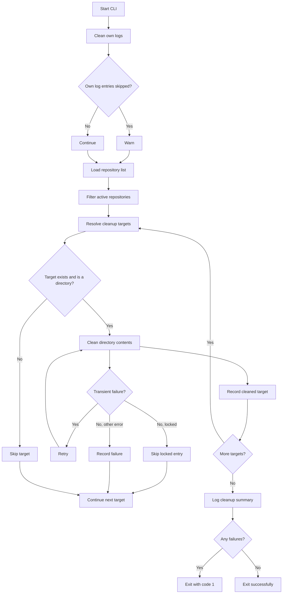

# logs-cleaner

A Node.js TypeScript command-line utility that scans configured local repositories, finds cleanup target directories, removes their contents, and reports the result as JSON log messages. It is designed for scheduled local repository maintenance rather than web crawling or data collection.

Built in June 2026, this project automates cleanup of `logs` folders and explicitly configured cleanup paths under local projects, with retry behavior for transient filesystem failures and skipping behavior for locked entries.

## Features

- 🔍 **Configured Repository Scanning**: Reads a JSON list of repositories and processes only entries marked as active
- 🤖 **Scheduled CLI Execution**: Can be invoked by `pnpm start` or wrapped in an actions-manager task definition
- ✉️ **Explicit Cleanup Targets**: Cleans configured paths such as `logs` or `db` when present in a repository entry
- 🗄️ **Cross-Platform Path Handling**: Resolves Windows-style and POSIX-style paths without following symlinks
- 🔄 **Retry Logic**: Retries transient cleanup failures before reporting them
- 🎯 **Safe Target Filtering**: Skips missing paths, non-directories, and symlinked cleanup targets
- 📊 **Structured JSON Logging**: Emits info, warning, and error messages as JSON lines for scheduler logs
- 🧪 **Vitest Test Coverage**: Covers path resolution, repository loading, target discovery, cleanup behavior, CLI orchestration, and the actions-manager wrapper
- 🚫 **Locked File Handling**: Treats `EBUSY` and `EPERM` cleanup failures as skipped paths instead of process failures
- 📝 **Actions Manager Integration**: Includes a `logsCleaner` action that spawns the CLI from the configured project path
- 🧹 **Nested Directory Cleaning**: Recursively empties directories while preserving the cleanup target directory itself
- 🇮🇱 **No Email Validation**: The current implementation is filesystem cleanup only and does not include crawler or email-validation logic

## Getting Started

### Prerequisites

- Node.js v20 or higher
- pnpm v8 or higher
- A JSON repository list containing repository objects
- Local filesystem access to the configured projects root

### Installation

1. Clone the repository:

```bash
git clone https://github.com/orassayag/logs-cleaner.git
cd logs-cleaner
```

2. Install dependencies:

```bash
pnpm install
```

3. Type-check the project:

```bash
pnpm build
```

### Quick Start

#### Test Mode (Development)

Run the test suite before exercising cleanup behavior on real paths:

```bash
pnpm test:no-coverage
```

For local experimentation, create a temporary repository list and project tree, then call `runCleanup` with those paths. Avoid running the default CLI against real repositories until the configured paths are correct.

#### Production Mode

Run the CLI against the configured repository list:

```bash
pnpm start
```

The default configuration reads repositories from `C:\Or\web\project-repos-names.json` under `C:\Or\web\projects`, resolves each active repository by name, and cleans the configured cleanup paths.

## Configuration

Edit the repository list JSON file and the optional `clear` field on each repository entry. The app does not use a separate settings file.

### Core Settings

Core constants live in `src/config.ts`:

- `DEFAULT_REPO_LIST_PATH`: Defaults to `C:\Or\web\project-repos-names.json`
- `DEFAULT_PROJECTS_ROOT`: Defaults to `C:\Or\web\projects`
- `DEFAULT_CLEAR_PATHS`: Defaults to `logs`
- `OWN_LOGS_PATH`: Defaults to `logs`
- `RETRY_ATTEMPTS`: Defaults to `3`
- `RETRY_DELAY_MS`: Defaults to `100`

### Search Configuration

This section is legacy crawler terminology. For `logs-cleaner`, the equivalent configuration is the cleanup path list:

- Repositories without a `clear` field clean `logs`
- Repositories with `clear: ["db", "logs"]` clean both paths relative to the repository
- Cleanup paths are resolved relative to each repository path

### Filtering

Filtering is limited to cleanup target safety checks:

- Repository list entries must be objects with `type: "active"`
- Missing cleanup targets are skipped
- Non-directory cleanup targets are skipped
- Symlinked cleanup targets are skipped
- Locked files or directories are skipped instead of failing the entire cleanup

See [INSTRUCTIONS.md](INSTRUCTIONS.md) for detailed setup and usage guidance.

## Available Scripts

### Main Application

```bash
pnpm start      # Run the cleanup CLI
pnpm dev        # Run the CLI in watch mode
```

### Testing Scripts

```bash
pnpm test              # Run Vitest with coverage
pnpm test:no-coverage  # Run Vitest without coverage
pnpm test:watch        # Run Vitest in watch mode
pnpm test:ui           # Run the Vitest UI
pnpm build             # Type-check the TypeScript project
pnpm lint              # Lint TypeScript source files
pnpm format            # Format TypeScript source files
pnpm format:check      # Check formatting without modifying files
```

## Project Structure

```
logs-cleaner/
├── src/
│   ├── index.ts                  # CLI entry point and cleanup orchestration
│   ├── config.ts                 # Default paths and retry settings
│   ├── types.ts                  # Shared TypeScript types
│   ├── project-repos.ts          # Repository list loading and active-entry filtering
│   ├── discovery.ts              # Cleanup target resolution
│   ├── cleanup.ts                # Recursive directory-content cleanup
│   ├── path-model.ts             # Windows and POSIX path normalization
│   ├── logger.ts                 # JSON line logging helper
│   └── actions-manager/
│       └── logs-cleaner.ts       # Actions-manager task wrapper
├── src/**/*.test.ts              # Vitest coverage for source modules
├── misc/
│   └── logs-cleaner.txt          # Product requirements notes
├── docs/
│   ├── plans/                    # Planning notes
│   └── plan-reviews/             # Plan review notes
├── package.json
├── tsconfig.json
├── vitest.config.ts
├── eslint.config.mjs
├── README.md
└── INSTRUCTIONS.md
```

## How It Works



## Architecture Flow

1. **CLI Layer**: `runCleanup` orchestrates own-log cleanup, repository loading, target resolution, and summary logging
2. **Repository Loader**: Reads a JSON array and keeps only entries where `type` is `active`
3. **Target Discovery**: Resolves configured cleanup paths relative to each repository and marks unsafe targets as skipped
4. **Path Model**: Normalizes Windows and POSIX paths without following symlinks
5. **Cleanup Service**: Recursively removes files and nested directories while preserving the target directory
6. **Retry Handling**: Retries transient failures and skips locked filesystem entries
7. **Logger**: Emits structured JSON messages for console and scheduler output
8. **Actions Manager Wrapper**: Spawns the CLI for scheduled task integration

## Email Validation Features

The current implementation does not validate email addresses. This section is retained from older crawler documentation and does not describe active project behavior.

## Console Status Example

The CLI logs JSON messages rather than animated console statistics:

```
{"level":"info","message":"Cleaned target.","detail":{"repoName":"actions-manager","repoPath":"C:\\Or\\web\\projects\\actions-manager","configuredPath":"logs","resolvedPath":"C:\\Or\\web\\projects\\actions-manager\\logs","status":"cleaned"}}
{"level":"info","message":"Cleanup summary.","detail":{"repositoriesProcessed":1,"targetsSkipped":0,"targetsCleaned":1,"targetsFailed":0}}
```

Warnings and errors use the same JSON structure with `level` set to `warn` or `error`.

## Output Files

The current implementation does not generate crawler output files in `dist/`. Its runtime output is the filesystem cleanup it performs plus JSON log lines written to the console. Runtime data is expected to live under `db/`, including `db/paths.json` in future path-caching work, but the current code does not write that cache.

## Development

### Running Tests

```bash
pnpm test:no-coverage
```

The tests cover:

- `project-repos.ts`: active repository filtering and invalid repo-list handling
- `discovery.ts`: default and configured cleanup paths, missing targets, non-directories, and symlinks
- `cleanup.ts`: recursive cleanup, symlink unlinking, retry behavior, and locked-file skipping
- `index.ts`: cleanup orchestration and summary behavior
- `path-model.ts`: Windows and POSIX path normalization
- `actions-manager/logs-cleaner.ts`: CLI spawning and non-zero exit handling

### Development Mode

Use `pnpm dev` for watch-mode development of the CLI. For safe behavioral testing, use the Vitest suite or call `runCleanup` with temporary repository and project roots.

## Contributing

Contributions to this project are [released](https://help.github.com/articles/github-terms-of-service/#6-contributions-under-repository-license) to the public under the [project's open source license](LICENSE).

Everyone is welcome to contribute. Contributing does not only mean submitting pull requests; it can also include reporting issues, improving tests, or clarifying documentation.

See [CONTRIBUTING.md](CONTRIBUTING.md) for detailed guidelines.

## Built With

- [Node.js](https://nodejs.org/) - JavaScript runtime
- [TypeScript](https://www.typescriptlang.org/) - Strictly typed implementation
- [pnpm](https://pnpm.io/) - Package manager
- [Vitest](https://vitest.dev/) - Test runner and coverage tool
- [ESLint](https://eslint.org/) - Linting
- [Prettier](https://prettier.io/) - Formatting

## License

This application has an MIT license - see the [LICENSE](LICENSE) file for details.

## Author

- **Or Assayag** - _Initial work_ - [orassayag](https://github.com/orassayag)
- Or Assayag <orassayag@gmail.com>
- GitHub: https://github.com/orassayag
- StackOverflow: https://stackoverflow.com/users/4442606/or-assayag?tab=profile
- LinkedIn: https://linkedin.com/in/orassayag

## Acknowledgments

- Built for local repository maintenance and scheduled cleanup tasks
- Designed to run on Windows while preserving cross-platform path support
- Uses structured logging so scheduler integrations can parse results consistently
